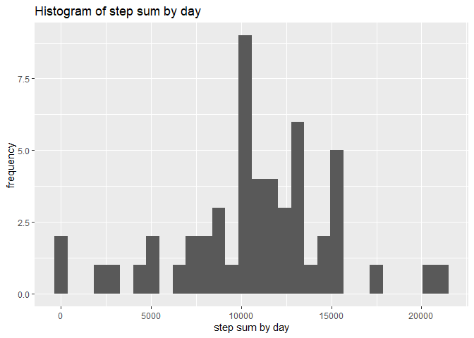

_Written by: Hung En Lai, 2020-04-14_

## Loading and preprocessing the data
First let's unzip and read the data into R and convert date column to `Date` format.


```r
unzip("activity.zip")
activity = read.csv("activity.csv")
activity$date = as.Date(as.character(activity$date))
str(activity)
```

```
## 'data.frame':	17568 obs. of  3 variables:
##  $ steps   : int  NA NA NA NA NA NA NA NA NA NA ...
##  $ date    : Date, format: "2012-10-01" "2012-10-01" ...
##  $ interval: int  0 5 10 15 20 25 30 35 40 45 ...
```
We can see that this is a dataframe with 17568 rows and 3 variables with names "steps", "date" and "interval".

## What is mean total number of steps taken per day?
To begin we omit the NA rows and store it into a new variable, `activity1`. Then we use `sapply` and `split` to calculate the sum of steps per day and store it in the variable `stepsums`. Histogram can be generated using `qplot` on `stepsums`. 


```r
library(ggplot2)
activity1 = na.omit(activity)
stepsums = sapply(with(activity1, split(steps, date)), sum)
qplot(stepsums, main = "Histogram of step sum by day", ylab="frequency", xlab = "step sum by day")
```

```
## `stat_bin()` using `bins = 30`. Pick better value with `binwidth`.
```

<!-- -->

```r
cat("The mean step sum is", mean(stepsums), ", and the median step sum is", median(stepsums), ".")
```

```
## The mean step sum is 10766.19 , and the median step sum is 10765 .
```

## What is the average daily activity pattern?

In this case we want to first calculate the mean of steps for each interval by grouping the data first by date (i.e. calculate step average at each interval). This requires the `group_by` and `summarise` function from the `dplyr` package, and the averages are stored in another data frame called `avgstep_byinterval`. Then the line plot can be generated from this data. The maximum step average can be accessed by using the `which.max` function.


```r
library(dplyr)
```

```
## 
## Attaching package: 'dplyr'
```

```
## The following objects are masked from 'package:stats':
## 
##     filter, lag
```

```
## The following objects are masked from 'package:base':
## 
##     intersect, setdiff, setequal, union
```

```r
activity_byinterval = group_by(activity, interval)
avgstep_byinterval = summarise(activity_byinterval, avgsteps = mean(steps, na.rm=T))
qplot(interval, avgsteps, data = avgstep_byinterval, geom = "line", main = "Average daily activity pattern", ylab = "Average steps", xlab = "Interval (min)")
```

<!-- -->

```r
Max.step = as.integer(avgstep_byinterval[with(avgstep_byinterval, which.max(avgsteps)),1])
cat("The maximum number of average step is at", Max.step, "min interval.")
```

```
## The maximum number of average step is at 835 min interval.
```

## Imputing missing values
I have chosen to use the mean of steps by interval to impute the NA values in steps. The new data frame is named `activity.replaced` and requires the `mutate` and `ifelse` functions.


```r
# Calculate number of NA's in steps column
na.num = sum(is.na(activity$steps))
cat("The number of missing values in steps is", na.num)
```

```
## The number of missing values in steps is 2304
```

```r
# Impute NAs with mean of steps by intervals, storing into a new data frame.
activity.replaced <- activity %>% group_by(interval) %>% mutate(steps = ifelse(is.na(steps), mean(steps, na.rm = T), steps))

# Plot a histogram
stepsums.replaced = sapply(with(activity.replaced, split(steps, date)), sum)
qplot(stepsums.replaced, main = "Histogram of step sum by day (NA imputed)", ylab="frequency", xlab = "step sum by day (NA imputed)")
```

```
## `stat_bin()` using `bins = 30`. Pick better value with `binwidth`.
```

<!-- -->

```r
cat("The mean step sum is", mean(stepsums.replaced), ", and the median step sum is", median(stepsums.replaced), ".")
```

```
## The mean step sum is 10766.19 , and the median step sum is 10766.19 .
```

By replacing the NA's in steps with mean of intervals, the mean step sum remains unchanged at 10766.19, whereas the median step sum has increased slightly from 10765 to 10766.19. As steps are integers, the median value is likely an imputed mean value. By replacing all NA's with the mean of steps by intervals, more step sums (by day) are now clustered around the mean, and therefore the median value is now equal to that of the mean.

## Are there differences in activity patterns between weekdays and weekends?

First a factor with 2 levels (weekday, weekend) is created using a logical vector by asking if the name of day is included in one of the five weekdays. Then the data is processed as previously by first grouping by interval and then day (weekday, weekend), and calculate the average steps (stored in `avgsteps`). The average steps are then plotted with `qplot` using the factor `day` as separator.


```r
weekdays <- c('Monday', 'Tuesday', 'Wednesday', 'Thursday', 'Friday')
activity.replaced$day <- as.factor(c('weekend', 'weekday')[(weekdays(activity.replaced$date) %in% weekdays)+1L])
activity_byinterval = group_by(activity.replaced, interval, day)
avgstep_byinterval = summarise(activity_byinterval, avgsteps = mean(steps))
qplot(interval, avgsteps, data = avgstep_byinterval, geom = "line", facets = day~., main = "Average daily activity pattern in weekday and weekend", ylab = "Average steps", xlab = "Interval (min)")
```

<!-- -->
By comparing the two panels, it seems that weekdays contribute mostly to the peak activity pattern observed previously (835 min). Weekend activity pattern seems to fluctuate less than that in weekdays.
